# Diagrammes Mermaid du projet Pharmacy

Ce document decrit le projet Laravel de gestion de pharmacie.
Les libelles dans les blocs Mermaid sont ecrits en francais sans accents et sans caracteres fragiles.

## Perimetre lu

- Routes web et API: `routes/web.php`, `routes/api.php`.
- Controleurs: `AuthController`, `MedicamentController`, `UserController`, `DashboardController`, `BackupController`.
- Modeles: `User`, `Medicament`, `Vente`, `VenteDetail`.
- Migrations: utilisateurs, medicaments, ventes, details de vente, tokens Sanctum, sessions, cache, jobs.
- Vues: `welcome.blade.php`, `report.blade.php`.
- Configuration utile: Sanctum, Auth, DomPDF, backup.

## Points importants du code

- Authentification API par Laravel Sanctum.
- Les routes protegees utilisent `auth:sanctum`.
- Roles utilises: `admin` et `pharmacien`.
- La creation, la modification et la suppression de medicaments verifient le role `admin`.
- La route `GET /api/backup` est publique dans le code actuel.
- La route `GET /api/dashboard` active est la closure de `routes/api.php`, pas `DashboardController@index`, car la meme route est declaree deux fois.
- La route `GET /api/stats` active est une closure, pas `DashboardController@stats`.
- `Route::apiResource('users', UserController::class)` ajoute aussi `GET /api/users/{user}`, mais `UserController` ne contient pas de methode `show`.
- La migration `add_image_to_produits_table` cible `produits`, mais aucune migration ne cree cette table. La table `medicaments` contient deja `image`.

## Carte des routes

| Methode | Route | Protection | Traitement |
| --- | --- | --- | --- |
| GET | `/` | public | Vue welcome |
| POST | `/api/register` | public | AuthController register |
| POST | `/api/login` | public | AuthController login |
| GET | `/api/login` | public | Reponse unauthenticated |
| GET | `/api/backup` | public | BackupController backup |
| GET | `/api/medicaments` | auth sanctum | MedicamentController index |
| POST | `/api/medicaments` | auth sanctum | MedicamentController store |
| PUT | `/api/medicaments/{id}` | auth sanctum | MedicamentController update |
| DELETE | `/api/medicaments/{id}` | auth sanctum | MedicamentController destroy |
| POST | `/api/ventes` | auth sanctum | MedicamentController vente |
| GET | `/api/ventes` | auth sanctum | Closure liste ventes |
| GET | `/api/users` | auth sanctum | UserController index |
| POST | `/api/users` | auth sanctum | UserController store |
| PUT | `/api/users/{id}` | auth sanctum | UserController update |
| DELETE | `/api/users/{id}` | auth sanctum | UserController destroy |
| GET | `/api/users/{user}` | auth sanctum | Ajoute par apiResource, methode show absente |
| PATCH | `/api/users/{user}` | auth sanctum | Ajoute par apiResource, update |
| PUT | `/api/users/{user}` | auth sanctum | Ajoute par apiResource, update |
| DELETE | `/api/users/{user}` | auth sanctum | Ajoute par apiResource, destroy |
| POST | `/api/logout` | auth sanctum | Closure suppression token |
| GET | `/api/dashboard` | auth sanctum | Closure tableau de bord |
| GET | `/api/stats` | auth sanctum | Closure statistiques |
| GET | `/api/report/pdf` | auth sanctum | Closure rapport PDF |

## MCD

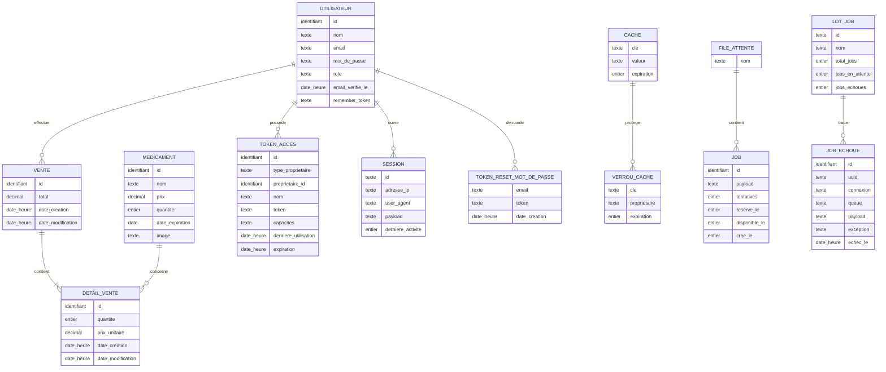
```mermaid
erDiagram
    UTILISATEUR ||--o{ VENTE : effectue
    VENTE ||--|{ DETAIL_VENTE : contient
    MEDICAMENT ||--o{ DETAIL_VENTE : concerne
    UTILISATEUR ||--o{ TOKEN_ACCES : possede
    UTILISATEUR ||--o{ SESSION : ouvre
    UTILISATEUR ||--o{ TOKEN_RESET_MOT_DE_PASSE : demande
    CACHE ||--o{ VERROU_CACHE : protege
    FILE_ATTENTE ||--o{ JOB : contient
    LOT_JOB ||--o{ JOB_ECHOUE : trace

    UTILISATEUR {
        identifiant id
        texte nom
        texte email
        texte mot_de_passe
        texte role
        date_heure email_verifie_le
        texte remember_token
    }

    MEDICAMENT {
        identifiant id
        texte nom
        decimal prix
        entier quantite
        date date_expiration
        texte image
    }

    VENTE {
        identifiant id
        decimal total
        date_heure date_creation
        date_heure date_modification
    }

    DETAIL_VENTE {
        identifiant id
        entier quantite
        decimal prix_unitaire
        date_heure date_creation
        date_heure date_modification
    }

    TOKEN_ACCES {
        identifiant id
        texte type_proprietaire
        identifiant proprietaire_id
        texte nom
        texte token
        texte capacites
        date_heure derniere_utilisation
        date_heure expiration
    }

    SESSION {
        texte id
        texte adresse_ip
        texte user_agent
        texte payload
        entier derniere_activite
    }

    TOKEN_RESET_MOT_DE_PASSE {
        texte email
        texte token
        date_heure date_creation
    }

    CACHE {
        texte cle
        texte valeur
        entier expiration
    }

    VERROU_CACHE {
        texte cle
        texte proprietaire
        entier expiration
    }

    FILE_ATTENTE {
        texte nom
    }

    JOB {
        identifiant id
        texte payload
        entier tentatives
        entier reserve_le
        entier disponible_le
        entier cree_le
    }

    LOT_JOB {
        texte id
        texte nom
        entier total_jobs
        entier jobs_en_attente
        entier jobs_echoues
    }

    JOB_ECHOUE {
        identifiant id
        texte uuid
        texte connexion
        texte queue
        texte payload
        texte exception
        date_heure echec_le
    }
```

## MPD

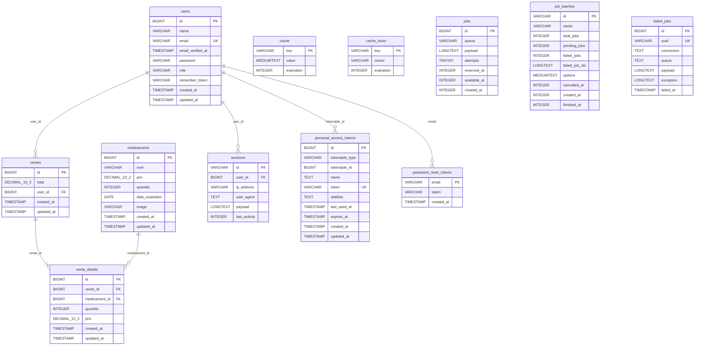
```mermaid
erDiagram
    users ||--o{ ventes : user_id
    ventes ||--|{ vente_details : vente_id
    medicaments ||--o{ vente_details : medicament_id
    users ||--o{ sessions : user_id
    users ||--o{ personal_access_tokens : tokenable_id
    users ||--o{ password_reset_tokens : email

    users {
        BIGINT id PK
        VARCHAR name
        VARCHAR email UK
        TIMESTAMP email_verified_at
        VARCHAR password
        VARCHAR role
        VARCHAR remember_token
        TIMESTAMP created_at
        TIMESTAMP updated_at
    }

    medicaments {
        BIGINT id PK
        VARCHAR nom
        DECIMAL_10_2 prix
        INTEGER quantite
        DATE date_expiration
        VARCHAR image
        TIMESTAMP created_at
        TIMESTAMP updated_at
    }

    ventes {
        BIGINT id PK
        DECIMAL_10_2 total
        BIGINT user_id FK
        TIMESTAMP created_at
        TIMESTAMP updated_at
    }

    vente_details {
        BIGINT id PK
        BIGINT vente_id FK
        BIGINT medicament_id FK
        INTEGER quantite
        DECIMAL_10_2 prix
        TIMESTAMP created_at
        TIMESTAMP updated_at
    }

    personal_access_tokens {
        BIGINT id PK
        VARCHAR tokenable_type
        BIGINT tokenable_id
        TEXT name
        VARCHAR token UK
        TEXT abilities
        TIMESTAMP last_used_at
        TIMESTAMP expires_at
        TIMESTAMP created_at
        TIMESTAMP updated_at
    }

    password_reset_tokens {
        VARCHAR email PK
        VARCHAR token
        TIMESTAMP created_at
    }

    sessions {
        VARCHAR id PK
        BIGINT user_id FK
        VARCHAR ip_address
        TEXT user_agent
        LONGTEXT payload
        INTEGER last_activity
    }

    cache {
        VARCHAR key PK
        MEDIUMTEXT value
        INTEGER expiration
    }

    cache_locks {
        VARCHAR key PK
        VARCHAR owner
        INTEGER expiration
    }

    jobs {
        BIGINT id PK
        VARCHAR queue
        LONGTEXT payload
        TINYINT attempts
        INTEGER reserved_at
        INTEGER available_at
        INTEGER created_at
    }

    job_batches {
        VARCHAR id PK
        VARCHAR name
        INTEGER total_jobs
        INTEGER pending_jobs
        INTEGER failed_jobs
        LONGTEXT failed_job_ids
        MEDIUMTEXT options
        INTEGER cancelled_at
        INTEGER created_at
        INTEGER finished_at
    }

    failed_jobs {
        BIGINT id PK
        VARCHAR uuid UK
        TEXT connection
        TEXT queue
        LONGTEXT payload
        LONGTEXT exception
        TIMESTAMP failed_at
    }
```

## Diagramme de cas d utilisation

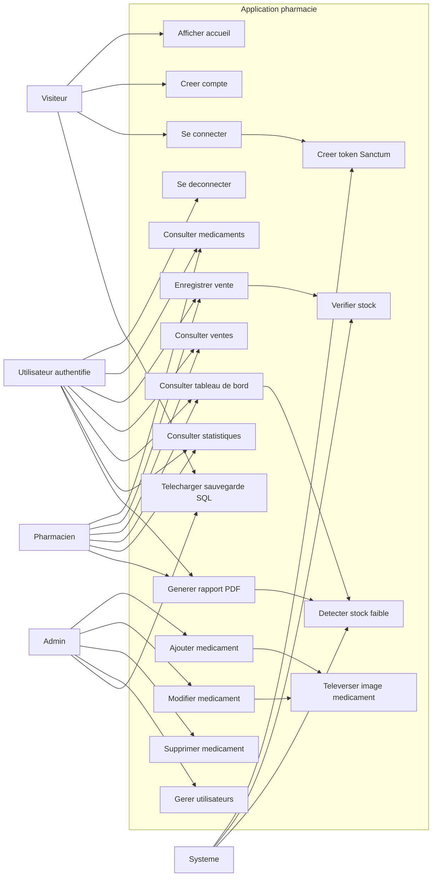
```mermaid
flowchart LR
    Visiteur[Visiteur]
    Utilisateur[Utilisateur authentifie]
    Pharmacien[Pharmacien]
    Admin[Admin]
    Systeme[Systeme]

    subgraph Application[Application pharmacie]
        UCAccueil[Afficher accueil]
        UCRegister[Creer compte]
        UCLogin[Se connecter]
        UCLogout[Se deconnecter]
        UCListMed[Consulter medicaments]
        UCCreateMed[Ajouter medicament]
        UCUpdateMed[Modifier medicament]
        UCDeleteMed[Supprimer medicament]
        UCVente[Enregistrer vente]
        UCListVentes[Consulter ventes]
        UCDashboard[Consulter tableau de bord]
        UCStats[Consulter statistiques]
        UCPdf[Generer rapport PDF]
        UCUsers[Gerer utilisateurs]
        UCBackup[Telecharger sauvegarde SQL]
        UCToken[Creer token Sanctum]
        UCCheckStock[Verifier stock]
        UCLowStock[Detecter stock faible]
        UCImage[Televerser image medicament]
    end

    Visiteur --> UCAccueil
    Visiteur --> UCRegister
    Visiteur --> UCLogin
    Visiteur --> UCBackup

    Utilisateur --> UCLogout
    Utilisateur --> UCListMed
    Utilisateur --> UCVente
    Utilisateur --> UCListVentes
    Utilisateur --> UCDashboard
    Utilisateur --> UCStats
    Utilisateur --> UCPdf

    Pharmacien --> UCListMed
    Pharmacien --> UCVente
    Pharmacien --> UCListVentes
    Pharmacien --> UCDashboard
    Pharmacien --> UCStats
    Pharmacien --> UCPdf

    Admin --> UCCreateMed
    Admin --> UCUpdateMed
    Admin --> UCDeleteMed
    Admin --> UCUsers
    Admin --> UCBackup

    UCLogin --> UCToken
    UCCreateMed --> UCImage
    UCUpdateMed --> UCImage
    UCVente --> UCCheckStock
    UCDashboard --> UCLowStock
    UCPdf --> UCLowStock
    Systeme --> UCToken
    Systeme --> UCCheckStock
    Systeme --> UCLowStock
```

## Diagramme de classes

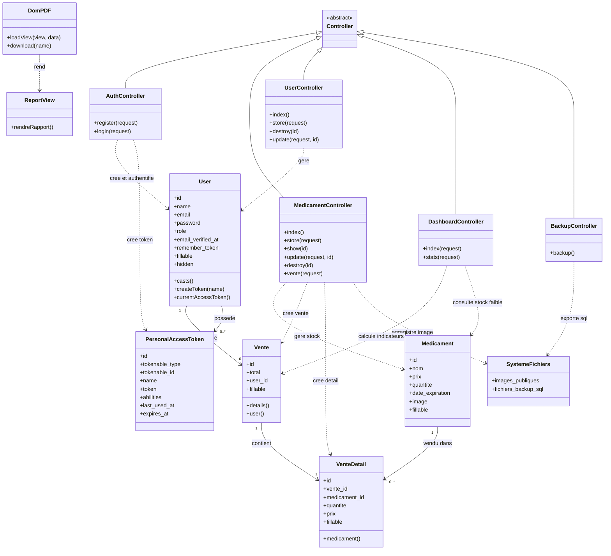
```mermaid
classDiagram
    class Controller {
        <<abstract>>
    }

    class AuthController {
        +register(request)
        +login(request)
    }

    class MedicamentController {
        +index()
        +store(request)
        +show(id)
        +update(request, id)
        +destroy(id)
        +vente(request)
    }

    class UserController {
        +index()
        +store(request)
        +destroy(id)
        +update(request, id)
    }

    class DashboardController {
        +index(request)
        +stats(request)
    }

    class BackupController {
        +backup()
    }

    class User {
        +id
        +name
        +email
        +password
        +role
        +email_verified_at
        +remember_token
        +fillable
        +hidden
        +casts()
        +createToken(name)
        +currentAccessToken()
    }

    class Medicament {
        +id
        +nom
        +prix
        +quantite
        +date_expiration
        +image
        +fillable
    }

    class Vente {
        +id
        +total
        +user_id
        +fillable
        +details()
        +user()
    }

    class VenteDetail {
        +id
        +vente_id
        +medicament_id
        +quantite
        +prix
        +fillable
        +medicament()
    }

    class PersonalAccessToken {
        +id
        +tokenable_type
        +tokenable_id
        +name
        +token
        +abilities
        +last_used_at
        +expires_at
    }

    class ReportView {
        +rendreRapport()
    }

    class DomPDF {
        +loadView(view, data)
        +download(name)
    }

    class SystemeFichiers {
        +images_publiques
        +fichiers_backup_sql
    }

    Controller <|-- AuthController
    Controller <|-- MedicamentController
    Controller <|-- UserController
    Controller <|-- DashboardController
    Controller <|-- BackupController

    AuthController ..> User : cree et authentifie
    AuthController ..> PersonalAccessToken : cree token
    MedicamentController ..> Medicament : gere stock
    MedicamentController ..> Vente : cree vente
    MedicamentController ..> VenteDetail : cree detail
    MedicamentController ..> SystemeFichiers : enregistre image
    UserController ..> User : gere
    DashboardController ..> Vente : calcule indicateurs
    DashboardController ..> Medicament : consulte stock faible
    BackupController ..> SystemeFichiers : exporte sql
    DomPDF ..> ReportView : rend

    User "1" --> "0..*" Vente : effectue
    Vente "1" --> "1..*" VenteDetail : contient
    Medicament "1" --> "0..*" VenteDetail : vendu dans
    User "1" --> "0..*" PersonalAccessToken : possede
```

## Sequence 1 - Accueil web

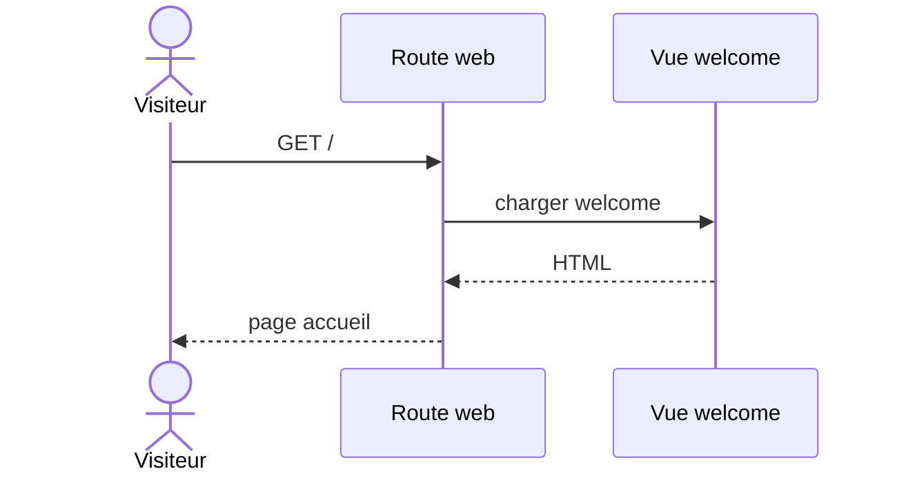
```mermaid
sequenceDiagram
    actor Visiteur
    participant Web as Route web
    participant View as Vue welcome

    Visiteur->>Web: GET /
    Web->>View: charger welcome
    View-->>Web: HTML
    Web-->>Visiteur: page accueil
```

## Sequence 2 - Inscription

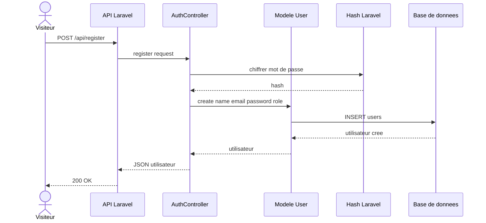
```mermaid
sequenceDiagram
    actor Visiteur
    participant API as API Laravel
    participant Auth as AuthController
    participant User as Modele User
    participant Hash as Hash Laravel
    participant DB as Base de donnees

    Visiteur->>API: POST /api/register
    API->>Auth: register request
    Auth->>Hash: chiffrer mot de passe
    Hash-->>Auth: hash
    Auth->>User: create name email password role
    User->>DB: INSERT users
    DB-->>User: utilisateur cree
    User-->>Auth: utilisateur
    Auth-->>API: JSON utilisateur
    API-->>Visiteur: 200 OK
```

## Sequence 3 - Connexion

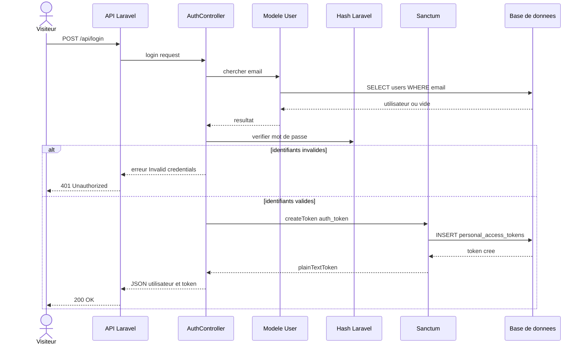
```mermaid
sequenceDiagram
    actor Visiteur
    participant API as API Laravel
    participant Auth as AuthController
    participant User as Modele User
    participant Hash as Hash Laravel
    participant Sanctum as Sanctum
    participant DB as Base de donnees

    Visiteur->>API: POST /api/login
    API->>Auth: login request
    Auth->>User: chercher email
    User->>DB: SELECT users WHERE email
    DB-->>User: utilisateur ou vide
    User-->>Auth: resultat
    Auth->>Hash: verifier mot de passe
    alt identifiants invalides
        Auth-->>API: erreur Invalid credentials
        API-->>Visiteur: 401 Unauthorized
    else identifiants valides
        Auth->>Sanctum: createToken auth_token
        Sanctum->>DB: INSERT personal_access_tokens
        DB-->>Sanctum: token cree
        Sanctum-->>Auth: plainTextToken
        Auth-->>API: JSON utilisateur et token
        API-->>Visiteur: 200 OK
    end
```

## Sequence 4 - Deconnexion

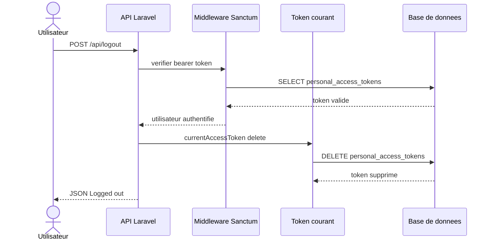
```mermaid
sequenceDiagram
    actor Utilisateur
    participant API as API Laravel
    participant Middleware as Middleware Sanctum
    participant Token as Token courant
    participant DB as Base de donnees

    Utilisateur->>API: POST /api/logout
    API->>Middleware: verifier bearer token
    Middleware->>DB: SELECT personal_access_tokens
    DB-->>Middleware: token valide
    Middleware-->>API: utilisateur authentifie
    API->>Token: currentAccessToken delete
    Token->>DB: DELETE personal_access_tokens
    DB-->>Token: token supprime
    API-->>Utilisateur: JSON Logged out
```

## Sequence 5 - Consulter les medicaments

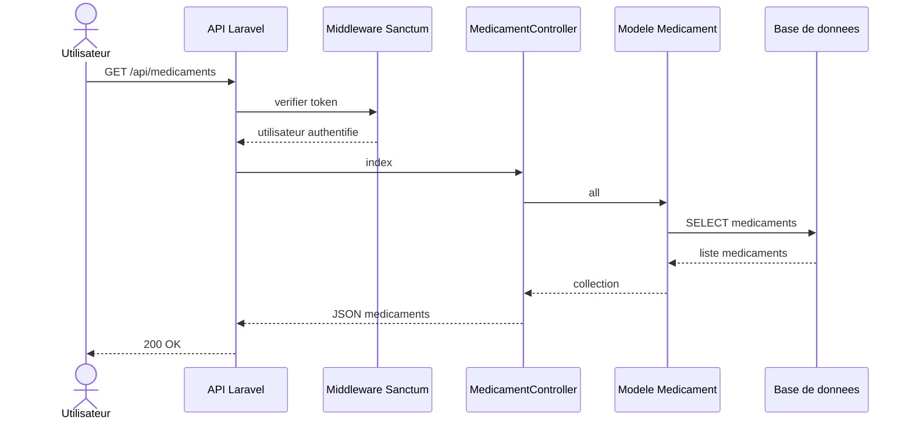
```mermaid
sequenceDiagram
    actor Utilisateur
    participant API as API Laravel
    participant Middleware as Middleware Sanctum
    participant Ctrl as MedicamentController
    participant Med as Modele Medicament
    participant DB as Base de donnees

    Utilisateur->>API: GET /api/medicaments
    API->>Middleware: verifier token
    Middleware-->>API: utilisateur authentifie
    API->>Ctrl: index
    Ctrl->>Med: all
    Med->>DB: SELECT medicaments
    DB-->>Med: liste medicaments
    Med-->>Ctrl: collection
    Ctrl-->>API: JSON medicaments
    API-->>Utilisateur: 200 OK
```

## Sequence 6 - Ajouter ou augmenter un medicament

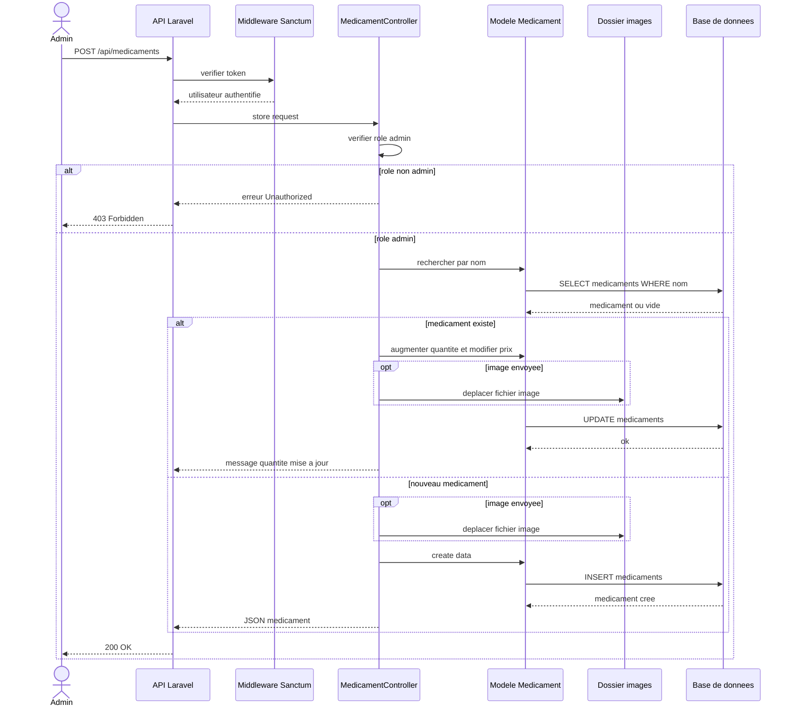
```mermaid
sequenceDiagram
    actor Admin
    participant API as API Laravel
    participant Middleware as Middleware Sanctum
    participant Ctrl as MedicamentController
    participant Med as Modele Medicament
    participant FS as Dossier images
    participant DB as Base de donnees

    Admin->>API: POST /api/medicaments
    API->>Middleware: verifier token
    Middleware-->>API: utilisateur authentifie
    API->>Ctrl: store request
    Ctrl->>Ctrl: verifier role admin
    alt role non admin
        Ctrl-->>API: erreur Unauthorized
        API-->>Admin: 403 Forbidden
    else role admin
        Ctrl->>Med: rechercher par nom
        Med->>DB: SELECT medicaments WHERE nom
        DB-->>Med: medicament ou vide
        alt medicament existe
            Ctrl->>Med: augmenter quantite et modifier prix
            opt image envoyee
                Ctrl->>FS: deplacer fichier image
            end
            Med->>DB: UPDATE medicaments
            DB-->>Med: ok
            Ctrl-->>API: message quantite mise a jour
        else nouveau medicament
            opt image envoyee
                Ctrl->>FS: deplacer fichier image
            end
            Ctrl->>Med: create data
            Med->>DB: INSERT medicaments
            DB-->>Med: medicament cree
            Ctrl-->>API: JSON medicament
        end
        API-->>Admin: 200 OK
    end
```

## Sequence 7 - Modifier un medicament

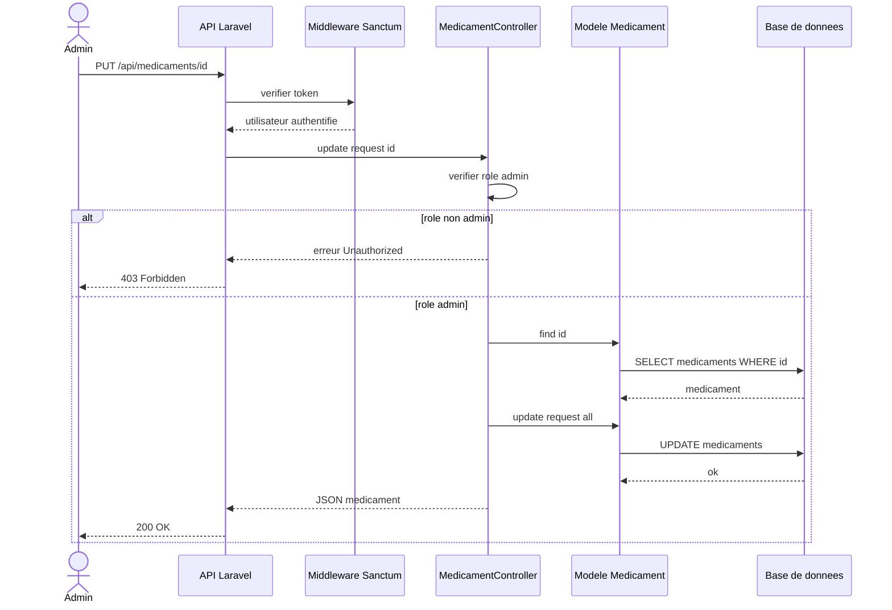
```mermaid
sequenceDiagram
    actor Admin
    participant API as API Laravel
    participant Middleware as Middleware Sanctum
    participant Ctrl as MedicamentController
    participant Med as Modele Medicament
    participant DB as Base de donnees

    Admin->>API: PUT /api/medicaments/id
    API->>Middleware: verifier token
    Middleware-->>API: utilisateur authentifie
    API->>Ctrl: update request id
    Ctrl->>Ctrl: verifier role admin
    alt role non admin
        Ctrl-->>API: erreur Unauthorized
        API-->>Admin: 403 Forbidden
    else role admin
        Ctrl->>Med: find id
        Med->>DB: SELECT medicaments WHERE id
        DB-->>Med: medicament
        Ctrl->>Med: update request all
        Med->>DB: UPDATE medicaments
        DB-->>Med: ok
        Ctrl-->>API: JSON medicament
        API-->>Admin: 200 OK
    end
```

## Sequence 8 - Supprimer un medicament

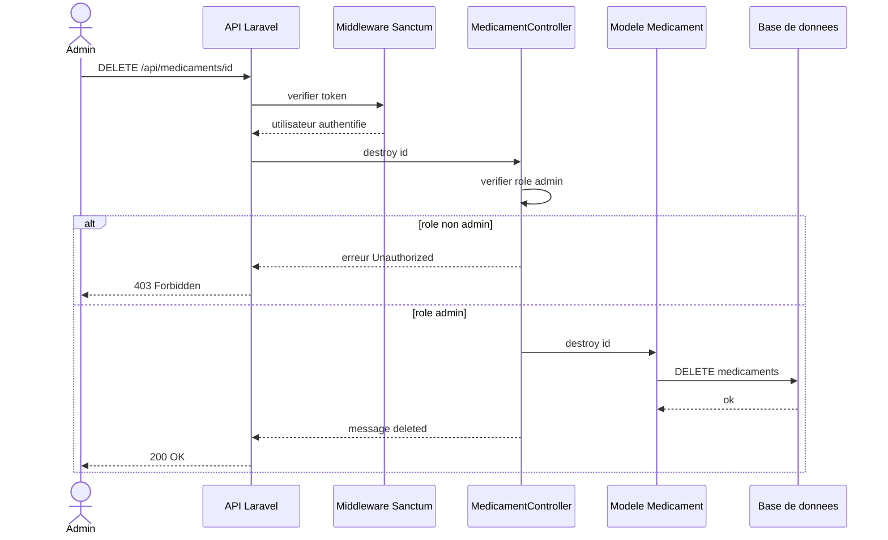
```mermaid
sequenceDiagram
    actor Admin
    participant API as API Laravel
    participant Middleware as Middleware Sanctum
    participant Ctrl as MedicamentController
    participant Med as Modele Medicament
    participant DB as Base de donnees

    Admin->>API: DELETE /api/medicaments/id
    API->>Middleware: verifier token
    Middleware-->>API: utilisateur authentifie
    API->>Ctrl: destroy id
    Ctrl->>Ctrl: verifier role admin
    alt role non admin
        Ctrl-->>API: erreur Unauthorized
        API-->>Admin: 403 Forbidden
    else role admin
        Ctrl->>Med: destroy id
        Med->>DB: DELETE medicaments
        DB-->>Med: ok
        Ctrl-->>API: message deleted
        API-->>Admin: 200 OK
    end
```

## Sequence 9 - Enregistrer une vente

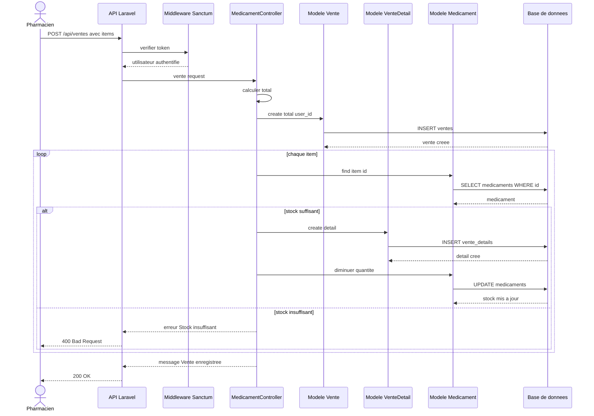
```mermaid
sequenceDiagram
    actor Pharmacien
    participant API as API Laravel
    participant Middleware as Middleware Sanctum
    participant Ctrl as MedicamentController
    participant Vente as Modele Vente
    participant Detail as Modele VenteDetail
    participant Med as Modele Medicament
    participant DB as Base de donnees

    Pharmacien->>API: POST /api/ventes avec items
    API->>Middleware: verifier token
    Middleware-->>API: utilisateur authentifie
    API->>Ctrl: vente request
    Ctrl->>Ctrl: calculer total
    Ctrl->>Vente: create total user_id
    Vente->>DB: INSERT ventes
    DB-->>Vente: vente creee
    loop chaque item
        Ctrl->>Med: find item id
        Med->>DB: SELECT medicaments WHERE id
        DB-->>Med: medicament
        alt stock suffisant
            Ctrl->>Detail: create detail
            Detail->>DB: INSERT vente_details
            DB-->>Detail: detail cree
            Ctrl->>Med: diminuer quantite
            Med->>DB: UPDATE medicaments
            DB-->>Med: stock mis a jour
        else stock insuffisant
            Ctrl-->>API: erreur Stock insuffisant
            API-->>Pharmacien: 400 Bad Request
        end
    end
    Ctrl-->>API: message Vente enregistree
    API-->>Pharmacien: 200 OK
```

## Sequence 10 - Consulter les ventes

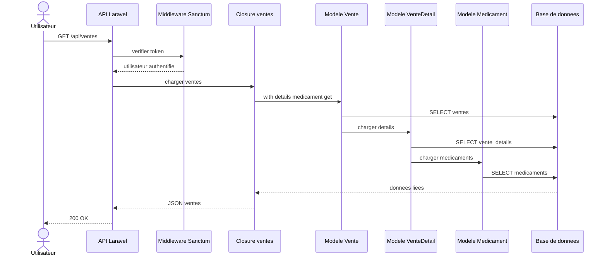
```mermaid
sequenceDiagram
    actor Utilisateur
    participant API as API Laravel
    participant Middleware as Middleware Sanctum
    participant Route as Closure ventes
    participant Vente as Modele Vente
    participant Detail as Modele VenteDetail
    participant Med as Modele Medicament
    participant DB as Base de donnees

    Utilisateur->>API: GET /api/ventes
    API->>Middleware: verifier token
    Middleware-->>API: utilisateur authentifie
    API->>Route: charger ventes
    Route->>Vente: with details medicament get
    Vente->>DB: SELECT ventes
    Vente->>Detail: charger details
    Detail->>DB: SELECT vente_details
    Detail->>Med: charger medicaments
    Med->>DB: SELECT medicaments
    DB-->>Route: donnees liees
    Route-->>API: JSON ventes
    API-->>Utilisateur: 200 OK
```

## Sequence 11 - Lister les utilisateurs

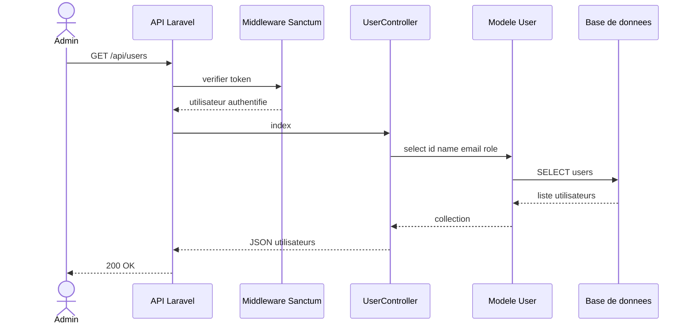
```mermaid
sequenceDiagram
    actor Admin
    participant API as API Laravel
    participant Middleware as Middleware Sanctum
    participant Ctrl as UserController
    participant User as Modele User
    participant DB as Base de donnees

    Admin->>API: GET /api/users
    API->>Middleware: verifier token
    Middleware-->>API: utilisateur authentifie
    API->>Ctrl: index
    Ctrl->>User: select id name email role
    User->>DB: SELECT users
    DB-->>User: liste utilisateurs
    User-->>Ctrl: collection
    Ctrl-->>API: JSON utilisateurs
    API-->>Admin: 200 OK
```

## Sequence 12 - Creer un utilisateur

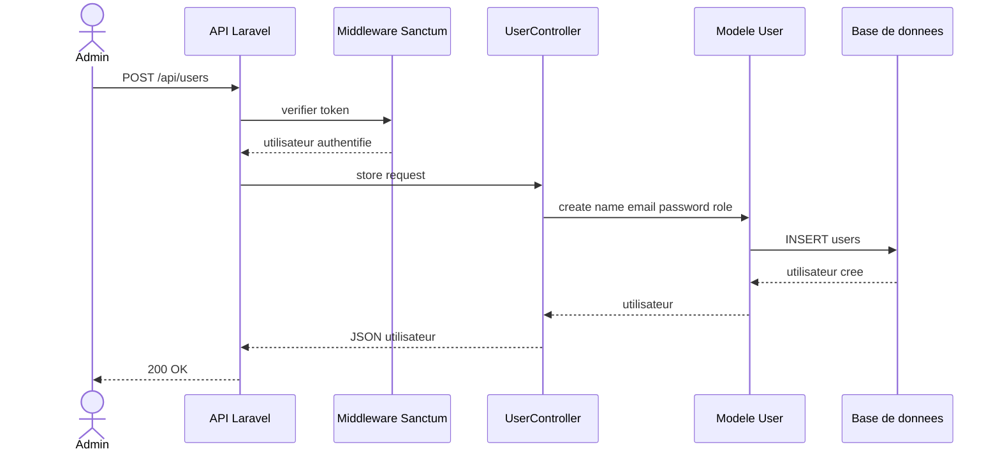
```mermaid
sequenceDiagram
    actor Admin
    participant API as API Laravel
    participant Middleware as Middleware Sanctum
    participant Ctrl as UserController
    participant User as Modele User
    participant DB as Base de donnees

    Admin->>API: POST /api/users
    API->>Middleware: verifier token
    Middleware-->>API: utilisateur authentifie
    API->>Ctrl: store request
    Ctrl->>User: create name email password role
    User->>DB: INSERT users
    DB-->>User: utilisateur cree
    User-->>Ctrl: utilisateur
    Ctrl-->>API: JSON utilisateur
    API-->>Admin: 200 OK
```

## Sequence 13 - Modifier un utilisateur

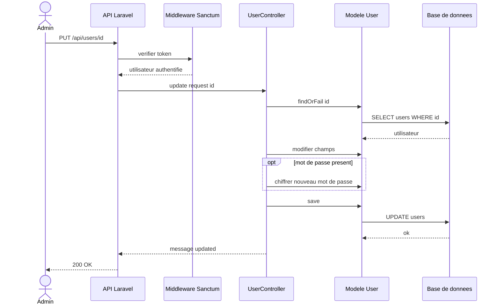
```mermaid
sequenceDiagram
    actor Admin
    participant API as API Laravel
    participant Middleware as Middleware Sanctum
    participant Ctrl as UserController
    participant User as Modele User
    participant DB as Base de donnees

    Admin->>API: PUT /api/users/id
    API->>Middleware: verifier token
    Middleware-->>API: utilisateur authentifie
    API->>Ctrl: update request id
    Ctrl->>User: findOrFail id
    User->>DB: SELECT users WHERE id
    DB-->>User: utilisateur
    Ctrl->>User: modifier champs
    opt mot de passe present
        Ctrl->>User: chiffrer nouveau mot de passe
    end
    Ctrl->>User: save
    User->>DB: UPDATE users
    DB-->>User: ok
    Ctrl-->>API: message updated
    API-->>Admin: 200 OK
```

## Sequence 14 - Supprimer un utilisateur

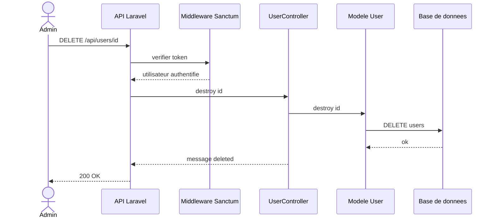
```mermaid
sequenceDiagram
    actor Admin
    participant API as API Laravel
    participant Middleware as Middleware Sanctum
    participant Ctrl as UserController
    participant User as Modele User
    participant DB as Base de donnees

    Admin->>API: DELETE /api/users/id
    API->>Middleware: verifier token
    Middleware-->>API: utilisateur authentifie
    API->>Ctrl: destroy id
    Ctrl->>User: destroy id
    User->>DB: DELETE users
    DB-->>User: ok
    Ctrl-->>API: message deleted
    API-->>Admin: 200 OK
```

## Sequence 15 - Route utilisateur show absente

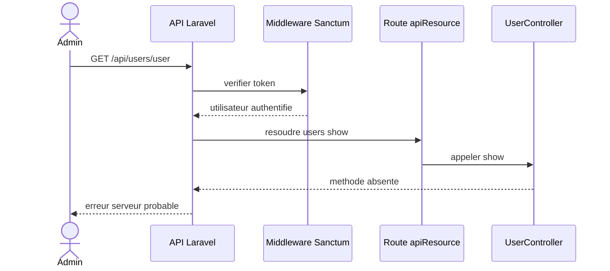
```mermaid
sequenceDiagram
    actor Admin
    participant API as API Laravel
    participant Middleware as Middleware Sanctum
    participant Router as Route apiResource
    participant Ctrl as UserController

    Admin->>API: GET /api/users/user
    API->>Middleware: verifier token
    Middleware-->>API: utilisateur authentifie
    API->>Router: resoudre users show
    Router->>Ctrl: appeler show
    Ctrl-->>API: methode absente
    API-->>Admin: erreur serveur probable
```

## Sequence 16 - Tableau de bord

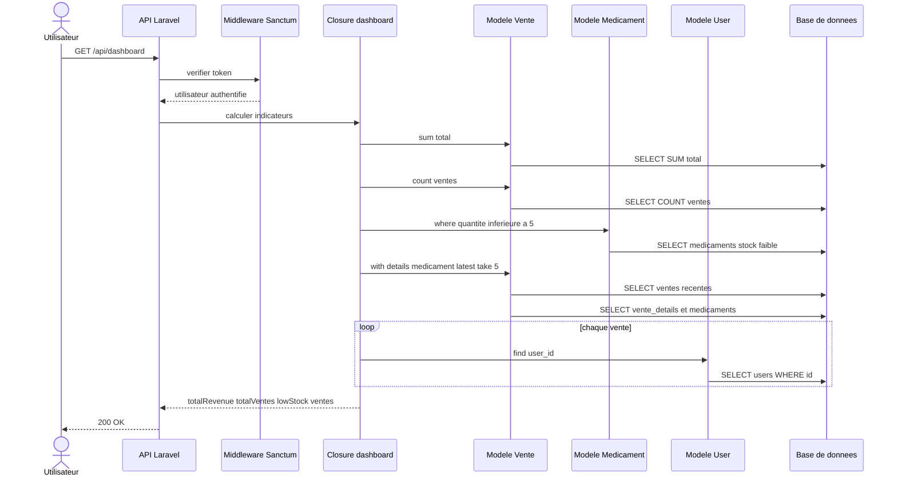
```mermaid
sequenceDiagram
    actor Utilisateur
    participant API as API Laravel
    participant Middleware as Middleware Sanctum
    participant Route as Closure dashboard
    participant Vente as Modele Vente
    participant Med as Modele Medicament
    participant User as Modele User
    participant DB as Base de donnees

    Utilisateur->>API: GET /api/dashboard
    API->>Middleware: verifier token
    Middleware-->>API: utilisateur authentifie
    API->>Route: calculer indicateurs
    Route->>Vente: sum total
    Vente->>DB: SELECT SUM total
    Route->>Vente: count ventes
    Vente->>DB: SELECT COUNT ventes
    Route->>Med: where quantite inferieure a 5
    Med->>DB: SELECT medicaments stock faible
    Route->>Vente: with details medicament latest take 5
    Vente->>DB: SELECT ventes recentes
    Vente->>DB: SELECT vente_details et medicaments
    loop chaque vente
        Route->>User: find user_id
        User->>DB: SELECT users WHERE id
    end
    Route-->>API: totalRevenue totalVentes lowStock ventes
    API-->>Utilisateur: 200 OK
```

## Sequence 17 - Statistiques

```mermaid
sequenceDiagram
    actor Utilisateur
    participant API as API Laravel
    participant Middleware as Middleware Sanctum
    participant Route as Closure stats
    participant Vente as Modele Vente
    participant Med as Modele Medicament
    participant DB as Base de donnees

    Utilisateur->>API: GET /api/stats
    API->>Middleware: verifier token
    Middleware-->>API: utilisateur authentifie
    API->>Route: calculer statistiques
    Route->>Vente: select date sum total group by date
    Vente->>DB: SELECT ventes groupees par date
    DB-->>Vente: ventes par date
    Route->>Med: select nom quantite
    Med->>DB: SELECT medicaments stock
    DB-->>Med: stocks
    Route-->>API: JSON ventes et stocks
    API-->>Utilisateur: 200 OK
```

## Sequence 18 - Rapport PDF

```mermaid
sequenceDiagram
    actor Utilisateur
    participant API as API Laravel
    participant Middleware as Middleware Sanctum
    participant Route as Closure report
    participant Vente as Modele Vente
    participant Med as Modele Medicament
    participant PDF as DomPDF
    participant View as Vue report
    participant DB as Base de donnees

    Utilisateur->>API: GET /api/report/pdf
    API->>Middleware: verifier token
    Middleware-->>API: utilisateur authentifie
    API->>Route: preparer donnees rapport
    Route->>Vente: sum total
    Vente->>DB: SELECT SUM total
    Route->>Vente: count ventes
    Vente->>DB: SELECT COUNT ventes
    Route->>Med: where quantite inferieure a 5
    Med->>DB: SELECT medicaments stock faible
    DB-->>Route: indicateurs
    Route->>PDF: loadView report donnees
    PDF->>View: rendre HTML
    View-->>PDF: HTML
    PDF-->>Route: PDF
    Route-->>API: download report.pdf
    API-->>Utilisateur: fichier PDF
```

## Sequence 19 - Sauvegarde SQL

```mermaid
sequenceDiagram
    actor Visiteur
    participant API as API Laravel
    participant Ctrl as BackupController
    participant Dump as mysqldump
    participant DB as Base pharmacy
    participant FS as Stockage local

    Visiteur->>API: GET /api/backup
    API->>Ctrl: backup
    Ctrl->>Ctrl: generer nom backup date
    Ctrl->>Dump: executer mysqldump root pharmacy
    Dump->>DB: lire schema et donnees
    DB-->>Dump: contenu SQL
    Dump->>FS: ecrire fichier backup
    FS-->>Ctrl: fichier pret
    Ctrl-->>API: download et suppression apres envoi
    API-->>Visiteur: fichier SQL
```

## Sequence 20 - Route login GET non authentifie

```mermaid
sequenceDiagram
    actor Client
    participant API as API Laravel
    participant Route as Closure login

    Client->>API: GET /api/login
    API->>Route: retourner unauthenticated
    Route-->>API: JSON message
    API-->>Client: 401 Unauthorized
```

## Sequence 21 - DashboardController non actif pour route dashboard

```mermaid
sequenceDiagram
    actor Developpeur
    participant Routes as routes api
    participant Ctrl as DashboardController
    participant Active as Closure dashboard

    Developpeur->>Routes: lire declarations dashboard
    Routes->>Ctrl: declaration index existe
    Routes->>Active: declaration closure meme chemin
    Active-->>Routes: route active dans route list
    Routes-->>Developpeur: GET api dashboard pointe vers closure
```
